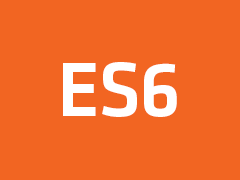

      

<h2 align="center">
  ECMAScript
</h2>

<h3 align="center">
  :rocket: Exercicíos de ES6 (ECMAScript) do curso Starter da Rocketseat  
</h3>

    
    

  

  <a href="#pushpin-info">Info</a>&nbsp;&nbsp;&nbsp;|&nbsp;&nbsp;&nbsp;
  <a href="#open_file_folder-modulos">Módulos</a>  

## :pushpin: Info

Este respositório é destinado a estudo do ES6(ECMAScript). Contém código com objetivo didático.

## :open_file_folder: Módulos

- [1° Módulo: Conceitos](https://github.com/gabrielbudke/starter/tree/master/src/es6/modulo-01)

---
Made by Gabriel Sousa
